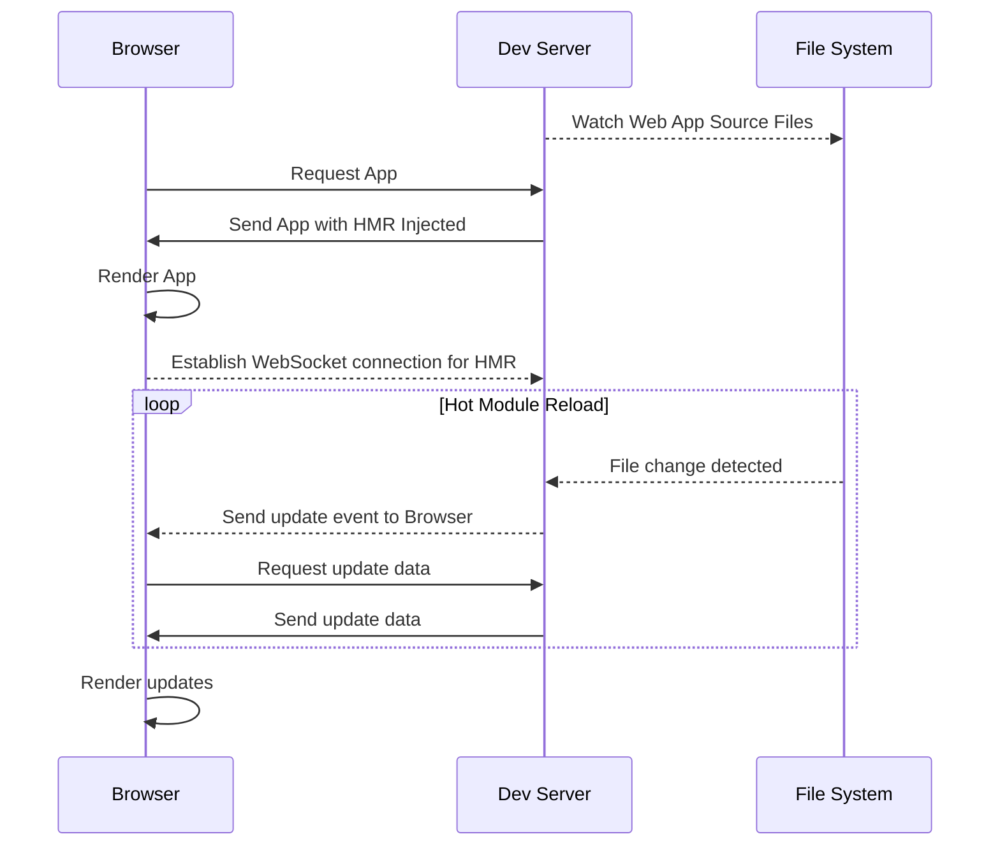

---
# You can also start simply with 'default'
theme: default
# random image from a curated Unsplash collection by Anthony
# like them? see https://unsplash.com/collections/94734566/slidev
background: https://cover.sli.dev
# some information about your slides (markdown enabled)
title: Trials and Tribulations of Self-Hosting Next.js
info: By Ethan Arrowood and Austin Akers
# apply unocss classes to the current slide
class: text-center
# https://sli.dev/features/drawing
drawings:
  persist: false
# slide transition: https://sli.dev/guide/animations.html#slide-transitions
transition: slide-left
# enable MDC Syntax: https://sli.dev/features/mdc
mdc: true
# open graph
# seoMeta:
#  ogImage: https://cover.sli.dev
---

# Trials and Tribulations of Self-Hosting Next.js

By Ethan Arrowood and Austin Akers

---
layout: two-cols-header
---

# Who we are

::left::


## Ethan Arrowood

::right::


## Austin Akers

---
layout: intro
---

# Overview

- 🎨 **Next.js on Harper**
- 🧑‍💻 **Dev Mode Support**
  <!-- WebSocket connection handling. Harper middleware system. -->
- 🧩 **Version Compatibility**
  <!-- Fairly simple section, but highlight how we use dynamic imports. Throw in there the like high-level idea of using 
  defensive code patterns to support backwards compatibility. We can particularly highlight that we had to demonstrate 
  compatibility with old Next.js versions just as a function of business. And then point to the exact line where we made 
  sure to defensively check that the dynamically imported Next server actually had the websocket/devmode hooks that we needed. -->
- 🚧 **Working Directory Platform Limitations** 
  <!-- While relevant to deployments too, this is particularly about how Harper is 
  itself a platform and thus the working directory may not able available to be set to the Next project. 
  Next itself is fine with this, but not all dependencies are. i.e. react-storefront -->
- 🚀 **Deployment Experience**
  <!-- Build mode support, analyzing the build output before pushing to production. integration with CI systems. 
  We can talk about Harper's particular component application deployment process, but relate it back to the expected 
  default experience for deploying Next.js i.e. Vercel and Netlify's default experience. ANd how we emulated that. -->
- 🗄️ **Custom Cache Handling**
  <!-- We actually didn't totally do this meaning we didn't add a custom Next.js cache handler (which is apart of the 
  Next.js server api). But as a platform we did investigate and add support for general request caching. i.e. plain http 
  request caching. harperdb/http-cache module. If time permits we can go into this part, but can also omit since we haven't 
  actually solved it or fully implemented it yet. May just be good to mention as like what we want to do next! -->

---
layout: section
---

# 🎨 Next.js on Harper

Next.js is a React framework that enables server-side rendering and static site generation for React applications. It is designed to make building production-ready applications easier and faster.

---
layout: section
---

# 🧑‍💻 Dev Mode Support

<!-- 
  As discussed in the previous section, Harper is a complete, full-stack application platform.
  As we integrated Next.js we wanted to ensure a quality developer experience. 
  Next.js' dev mode is a critical part of that experience.
-->

---

## What is _Dev Mode_?

- Hot Reloading
<!-- Instant feedback loop where code changes are reflected in the browser without a full page reload. -->
- Fast Refresh
<!-- Preserves component state throughout refreshes, allowing for a smoother development experience. -->
- Error Overlay
<!-- Displays errors and warnings in the browser, making it easier to debug issues. -->
- Dev-Tools Integration
<!-- Component inspection, performance profiling, and more. -->

---
layout: center
---

🔑 Improved developer experience

<!-- Highlight HMR/Fast Refresh as the piece we are going to focus on -->

---
layout: center
---

<!-- Go through the diagram step by step -->



---

Code Example

```javascript
const protocol = window.location.protocol === "http:" ? "ws://" : "wss://";
const address = protocol + window.location.host + window.location.pathname + "ws";
const socket = new WebSocket(address);
socket.addEventListener("message", (event) => {
  switch (event.data) {
    case "reload":
      window.location.reload();
      break;
    default:
      console.warn(`Unknown message: ${event.data}`);
      break;
  }
});
console.log("Live Reload Enabled 🔥");
```

<!-- https://github.com/Ethan-Arrowood/live-reload/blob/9428045a32d9e5cbd3161918093fe633ea13eac8/packages/live-reload/live-reload-script.html#L4 
  Discuss how this is a simplified version of the code we use to handle live reload but in essence this is how it works!
-->

---

<!-- Then, go back to how Harper is an integrated platform with its own HTTP and WebSocket support -->

<!-- Highlight the Next.js Server upgrade handler hook -->

<!-- We have to somehow hook into the existing websocket server and pass through the websocket upgrade and subsequent messages -->

---
transition: slide-down
---

## Version Compatibility

- Dynamic imports
- Defensive code patterns
- Backwards compatibility
- WebSocket and dev mode hooks
- Harper middleware system
- HarperDB HTTP cache module

---
transition: slide-left
---

## Working Directory Platform Limitations

- Harper is a platform
- Working directory may not be available
- Next.js is fine with this

---
transition: slide-right
---

## Deployment Experience
- Build mode support
- Analyzing the build output
- Integration with CI systems
- Harper's component application deployment process
- Vercel and Netlify's default experience
- Emulating that experience

---
transition: slide-up
---

## Custom Cache Handling
- HarperDB HTTP cache module
- General request caching
- Next.js cache handler
- Future work
- What we want to do next

---
transition: slide-up
---

## Conclusion
- Trials and tribulations of self-hosting Next.js

