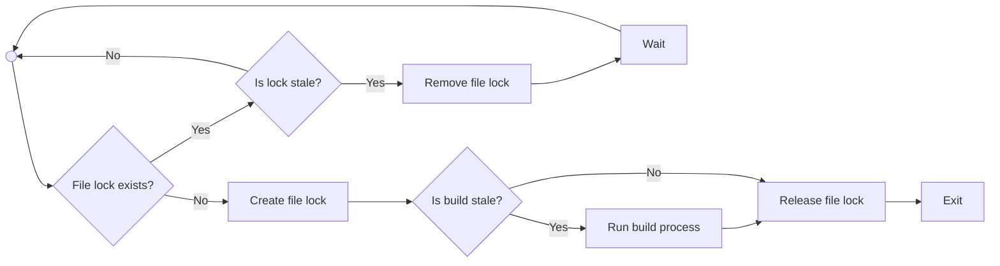

# Trials and Tribulations of Self-Hosting Next.js

By Ethan Arrowood and Austin Akers

---
layout: two-cols
transition: slide-left
---


<h2 class="text-center">Ethan Arrowood</h2>

::right::


<h2 class="text-center">Austin Akers</h2>

<!-- Each of us introduce ourselves. Include titles.
Whoever is kicking off should start with a transition along the lines of: "Lets get into it!" -->

---


<!--
Harper is a serverfull, all-in-one Node.js platform with full fil system access, an embedded database, networking middleware system, and application hosting support.
It is built on top of Node.js and operates in a single process, using worker threads for performance, and production scaling via clustering and replication.
The whole platform works together to provide an high performance, easy to use, enterprise-grade development experience.
-->

---
layout: fact
transition: slide-left
---

<h2>Harper<s>DB</s></h2>
<h3>harpersystems.dev</h3>

<!-- Oh yeah! You may have known us as HarperDB previously, recently we rebranded and our now entirely Harper! You may still see "HarperDB" floating around though as we slowly update the name across all our systems -->

---


<!--
"Next.js is a full-stack react framework for building modern web applications."
"It uses common patterns like server-side rendering, static site generation, and client-side rendering to provide a flexible and powerful development experience."
"But Next.js is more than just what it can create. The entire development experience from prototyping to production is what makes Next.js so powerful."
 -->

---
layout: center
transition: slide-left
---

# Hosting Next.js is surprisingly hard

<!-- quick slide - say whats on screen and move on - because the hook comes from next slide -->

---
layout: center
transition: slide-left
---

# Its much more than just `next start`

<!-- Say whats on the slide and then... -->
<!-- Our goal was not just to host Next.js apps, but provide a holistic Next.js application development experience -->

---
transition: slide-left
---

# Supporting Next.js

<!-- <div class="grid grid-cols-4 gap-4 mt-16 text-center">
<div>
Develop
</div>
<div>
  Build
</div>
<div>
  Deploy
  </div>
<div>
  Run
  </div>
</div> -->

<!-- either or - goal: display each step one at a time on the same slide. -->

<v-clicks>

- Develop
- Build
- Deploy
- Run

</v-clicks>

<!--
So, we came up with a high-level framework to dictate what it means to support Next.js 
First, "Develop"
Then, "Build"
Next, "Deploy"
Finally, "Run"

"Let's dive right in"
-->

---
layout: center
transition: slide-up
---

# Develop

<!-- The first aspect of our framework is "Develop". For us, this meant parity with Next.js' excellent developer experience -->

---
layout: center
transition: slide-up
---

# `next dev`

<!-- for most developers the first part of Next.js they interact with is the `next dev` command -->

---
transition: slide-up
---

# Dev Mode

<v-clicks>

- Hot Module Reloading
  - _Instant feedback loop where code changes are reflected in the browser without a full page reload._
- Fast Refresh
  - _Preserves component state throughout refreshes, allowing for a smoother development experience._
- Error Overlay
  - _Displays errors and warnings in the browser, making it easier to debug issues._
- Dev-Tools Integration
  - _Displays errors and warnings in the browser, making it easier to debug issues._

</v-clicks>

<!-- This is the high-level feature summary slide of "what is Dev Mode" -->
<!-- probably good enough to just flip through them quickly and continue moving on... -->

---
layout: center
transition: slide-up
---

# Hot Module Reloading

<!-- 
We want to highlight one of the harder aspects of supporting dev mode which was integrating Next.js' Hot Module Reloading with Harper's WebSocket middleware
-->

---
transition: slide-up
layout: image
image: /images/HMR-Sequence-Diagram.png
backgroundSize: contain
---

---
layout: center
transition: slide-up
---

# What is a WebSocket?

<!-- TODO: Keep this brief. Maybe just do the Request/Response HTTP snippets (use the code line highlighter to focus on the `Upgrade & Connection` parts) 
-->

```http {none|1-8|1-3|4-5|10-13|6-8,14-15|all}{lines:true}
# Request
GET /_next/webpack-hmr HTTP/1.1
Host: localhost:9926
Upgrade: websocket
Connection: upgrade
Sec-WebSocket-Version: 13
Sec-WebSocket-Key: *****
Sec-Websocket-Protocol: hmr

# Response
HTTP/1.1 101 Switching Protocols
Upgrade: websocket
Connection: upgrade
Sec-WebSocket-Accept: *****
Sec-WebSocket-Protocol: hmr
```

<!--
(Click through the code snippet to highlight the key parts as these bullets are read)
- But what is a websocket?
- WebSockets enable full duplex communication between client and server, allowing for real-time data exchange, without the need of HTTP request polling.
- The request starts as a regular HTTP GET Request
- That includes the special Upgrade and Connection headers
- The server responds with a 101 Switching Protocols response
- And there may be additional `Sec-WebSocket-*` headers for additional security and protocol information
- Once established, the connection remains open, allowing for continuous data exchange without the overhead of HTTP request polling.
 -->

---
layout: center
transition: slide-up
---

# Harper's networking middleware

```js {1-3|5,11,17|5-9|11-15|17-23}{lines:true }
server.socket((socket) => {
  /* Same as net.createServer() */
}, { port: 1234 });

server.http((req, res, next) => {
  if (req.url === 'ping') res.end('pong');

  return next(req, res);
});

server.ws((ws, req, chainCompletion, next) => {
  if (req.url === '/ping') ws.send('pong');

  return next(ws, req, chainCompletion);
});

server.upgrade((req, socket, head, next) => {
  if (req.url === '/_next/webpack-hmr') {
    // Handle the WebSocket upgrade for HMR
  }

  return next(req, socket, head);
}, { runFirst: true });


```

<!--
"Remember Harper's architecture diagram? We have a highly extensible networking middleware system"
"This system allows us to hook into the request/response lifecycle and do custom HTTP upgrade and WebSocket connection handling"
- We enable creating a fully custom TCP socket server with `server.socket()` (which is similar to Node.js' `net.createServer()`)
- Then we have 3 middleware methods, `http`, `ws`, and `upgrade`.
- The `http` method is used to handle regular HTTP requests, we have an embedded HTTP server that can be hooked into, but you can also specify the `port` property to create a new HTTP server.
- The `ws` method is used to handle WebSocket connections, and it allows us to handle WebSocket messages and events. Similarly, we have a default, but a custom port can be specified too.
- Finally, the `upgrade` method is used to handle WebSocket upgrades, which is what we need for Next.js' Hot Module Reloading.
  - You'll noticed on this example we are using the `runFirst` option, which allows us to run this middleware before any other WebSocket middleware (for the default WS connection).
- This networking API allows developers to create highly customized networking solutions, and it is the foundation for our Next.js support.
-->

---
layout: center
transition: slide-up
---

# Next.js Server API

```javascript {all|1-6|8|10-12}{lines:true}
import next from 'next';

const app = next({
  dir: 'path/to/app',
  dev: true
});

await app.prepare();

const requestHandler = app.getRequestHandler();

const upgradeHandler = app.getUpgradeHandler();
```


<!--
- And like we said at the beginning, supporting Next.js is much more than just `next start`.
- It isn't very well known, but Next.js has a server API that allows for programmatic control over the server.
- It isn't too complex, basically after importing the `next` package, you can create a Next.js server instance by calling the imported function
  - It has a number of options, but for right now we are only interested in the `dir` and `dev` options.
- Then you can call `await app.prepare()` to prepare the application
- Finally, you can get the request handler and upgrade handler by calling `app.getRequestHandler()` and `app.getUpgradeHandler()`, respectively.
-->

---
layout: center
transition: slide-left
---

# Putting it all together

```javascript {1-5,13|6,10|7-9|12}
// Next.js upgrade handler
const upgradeHandler = app.getUpgradeHandler();

// Harper upgrade middleware
server.upgrade((req, socket, head, next) => {
  if (req.url === '/_next/webpack-hmr') {
    return upgradeHandler(req, socket, head).then(() => {
      return next(req, socket, head);
    })
  }

  return next(req, socket, head);
}, { runFirst: true });
```
<!--
1. Get the upgrade handler from Next.js and setup the Harper upgrade handler.
  a. Use the `runFirst` option to ensure that the Next.js upgrade handler runs first.
2. Then inspect the request URL to see if it matches the Webpack HMR endpoint.
3. If it does, call the Next.js upgrade handler to upgrade the connection.
  b. There is some additional nuance to this that I'm glossing over here, but the key is that even after upgrading its important to call `next` so that additional middleware can run.
4. And if it  doesn't match, just call `next` to continue processing the upgrade request.
-->

--- 
layout: center
transition: slide-left
---

# Lastly, `harperdb-nextjs dev`

<!-- TODO: Insert a small recording / gif of our CLI kicking off and starting up both Harper and the Next.js dev server in a terminal -->

<!-- 
"Since Harper is a complete platform, and we run their application within the Harper process, we created our own CLI experience "
"It is quite simple, but it is important that it bootstraps Harper and ensures the right environment is set up for Next.js development (including enabling the HMR support!)."
-->

---
transition: slide-up
layout: center
---

# Build

---
layout: center
transition: slide-up
---

# `harperdb-nextjs build`


<!--
The next step in our framework is to support building Next.js apps
This was where our CLI experience really started to take shape
Just like the `next dev` command, we created a `harperdb-nextjs build` command that would run the Next.js build process and then cleanly exit
Since Harper is a whole platform, we needed to ensure the system was started up, the build ran, and then the process exited cleanly
-->

---
transition: slide-up
---

# Single Process, Multi-Threaded

<!--
TODO: turn this into a excalidraw diagram
IDEA: Use colors to highlight the yes/no paths
Investigate the right way to indicate a like loop in the diagram
-->


<!-- 
Given that Harper is a single process, multi-threaded platform, we needed to ensure that the build process was isolated
Threads in Harper generally all do the same thing unless we specify otherwise.
We are actively improving this experience, but at the beginning we created a custom file-based thread locking mechanism to ensure that only one thread would run the build process.
(step through diagram of file locking mechanism - highlight the key steps like checking mod time and pieces like that)
 -->

---
layout: center
transition: slide-left
---

<!-- Consider starting the Deploy section here? This is definitely the best transition -->

# Unlike Serverless, No Ephemeral Builds/Deployments

## Build artifacts add up quickly!

<!-- Could replace this with a static image but the idea is I wanted something to represent that build artifacts take up a lot of space -->
<!-- Also, funny gif for 3/4 of the way through the talk. The last slides have all been quite dense. Good to lighten it up -->


<!-- Now transition into the Deploy section by first talking about architecture -->

<!-- 
Unlike serverless platforms that treat each build and deployment as a unit of work, Harper is a long running process.
We couldn't really provide the same ephemeral build experience without completely ~blowing up~ (use better word here) our users's Harper instances (turns out build artifacts can add up quite quickly!!).
So instead, at least for now, we kept things simple. Builds can happen either locally or remotely, but they will always override what is currently running.
And this leads us to the next step in our framework: Deploy.
 -->

---
layout: center
transition: slide-up
---

# Deploy
<!--
Naturally, after development its time to get your application live
-->

---
layout: center
transition: slide-up
---

# TODO cluster/replication diagram
<!-- TODO diagram of cluster/replication -->

<!-- Now we briefly mentioned that Harper is a long running process, and for our production systems often clustered and replicated across regions. -->

---
layout: center
transition: slide-up
---

<!--  Maybe another gif? Not sure of a good diagram idea -->

# Rollouts

<!-- Going back to the idea of Ephemeral deployments, remember that Harper is all-in-one platform. 
You wouldn't want your entire database to be reset every time you deployed your web app, right? 
So our solution is to use a rolling deployment system. This is particularly linked to our replication system where the function of _deploying_ the app is simply an operation like any other on the platform.
And so as long as we indicate it should be replicated, then every instance in the network will receive the deploy operation.
-->

---
layout: center
transition: slide-left
---

`harperdb deploy`

<!-- 
Note: this isn't tied to the Next.js CLI anymore
Reiterate the idea that deployments is a general operation on Harper, not just Next.js
Make the point that we discovered this part of the framework was easiest to abstract and generalize to support all kinds of applications, not just Next.js.

Depending on time... this might be a good place to expand a little bit into Harper as a platform, but remember no sales pitches!
-->

---
layout: center
transition: slide-up
---

# Run

<!-- Finally, the app is build and deployed, now its time to run it! -->

---
layout: center
transition: slide-up
---

No, we still aren't using `next start`

<!-- Relate back to the joke at the beginning -->

---
layout: center
transition: slide-up
---

Next.js Server API again

```javascript
import next from 'next';

const app = next({ dir: componentPath });

await app.prepare();

const requestHandler = app.getRequestHandler();

	server.http(
		(request, next) => {
      // TODO: use a better logic here to demonstrate the request handling logic.
      // MAYBE some sort of basic routing? Like, we can say that in this naive example, the app is just hosted at `/` 
      // MAYBE frame it like "process last - if Harper hasn't handled it, then pass it to Next.js"
			return request._nodeResponse === undefined
				? next(request)
				: requestHandler(
          request._nodeRequest,
          request._nodeResponse,
          urlParse(request._nodeRequest.url, true)
        );
		}
	);
```

<!-- 
So just like we used the Next.js Server API to handle WebSocket upgrades, we can also use it to run the application.

We can use the `getRequestHandler` method to get a request handler that can be used to handle incoming requests.

(walk through code snippet of using getRequestHandler to create a request handler and then use it with Harper's HTTP server)
 -->

---
layout: center
transition: slide-up
---

Version Compatibility

```javascript
import { createRequire } from 'node:module';

const appPath = 'path/to/nextjs/app'; // or maybe `getAppPath()` 
const appRequire = createRequire(applicationPath);

const nextImport = await import(appRequire.resolve('next'));

const next = nextImport.default || nextImport;
```

<!-- 
Next.js has many versions, and honestly it takes a lot of time for users to migrate and upgrade. so it was imperitive we support multiple versions of Next.js.

We do this by using the applications included Next package and dynamically importing it. 

(walk through code snippet and touch on both dynamic imports in Node as well as the fact that our extension system gets the file system of the application and can use that to its advantage)

 -->

---
layout: center
transition: slide-up
---

<!-- THINKING OUTLOUD: Not really sure I like this section anymore. I like the technical point we make in previous slide. This doesn't add much value and I can't think of a good way to present it. -->

Short story about Next 9

<!-- Maybe funny graphic or gif or meme? -->

<!-- Furthermore, we had the unique challenge of supporting a very old Next.js version!
With Next 9 it actually worked surprisingly well, but unfortunately we had to drop support for the dev mode because it didn't have any upgrade handler API.
Kudos to the Next team for maintaining backwards compatibility for so long!
 -->

---
layout: center
transition: slide-up
---


Multi-Zone support

<!--
We probably sound like a broken record at this point, but Harper isn't your isolated, serverless environment host.
We have the ability to run multiple applications in the same process, and this naturally lead us to exploring support for Next.js multi-zone applications (micro-frontends).
 -->

---
layout: center
transition: slide-up
---

<!-- Insert diagram of handler flow -->

<!-- 
One of the key details is that our handler system naturally supported simplified, url based passthroughs.
So we load the apps in reverse specificity order, and as the request flows through the handler chain, it will match the first app that has a handler for the request.
This allows us to support multi-zone applications without any additional configuration.
-->

---
layout: center
transition: slide-up
---

... With one exception

---
layout: center
transition: slide-up
---

Working Directory Limitation

<!--
One of the biggest limitations of being a single process platofrm is that we have a single working directory.

This means that we cannot run multiple Next.js applications in the same process if they have conflicting working directories.

Now Next.js itself doesn't have this limitation, but some application dependencies do.

We haven't really found a workaround for this, but its generally avoidable with good application design and implementation
-->

---
layout: center
transition: slide-up
---

Custom Cache Handling
<!-- Bonus future work section if we have the time for it -->

---
layout: section
---

# What's Next?

Open issues: working directory limitation, full test coverage, feature parity.

What excites you: pushing custom caching deeper, extending to other frameworks.

---
layout: section
---

# Conclusion

Recap the lifecycle: Dev → Build → Deploy → Run.

Key takeaway: You can self-host Next.js, but it’s more than just npm start.

Invite folks to dig into the GitHub repo, ask questions.


