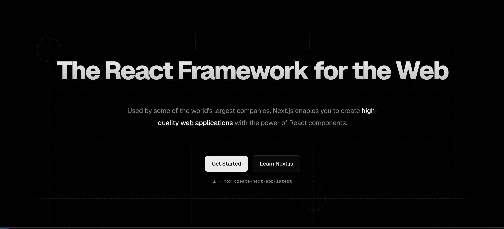
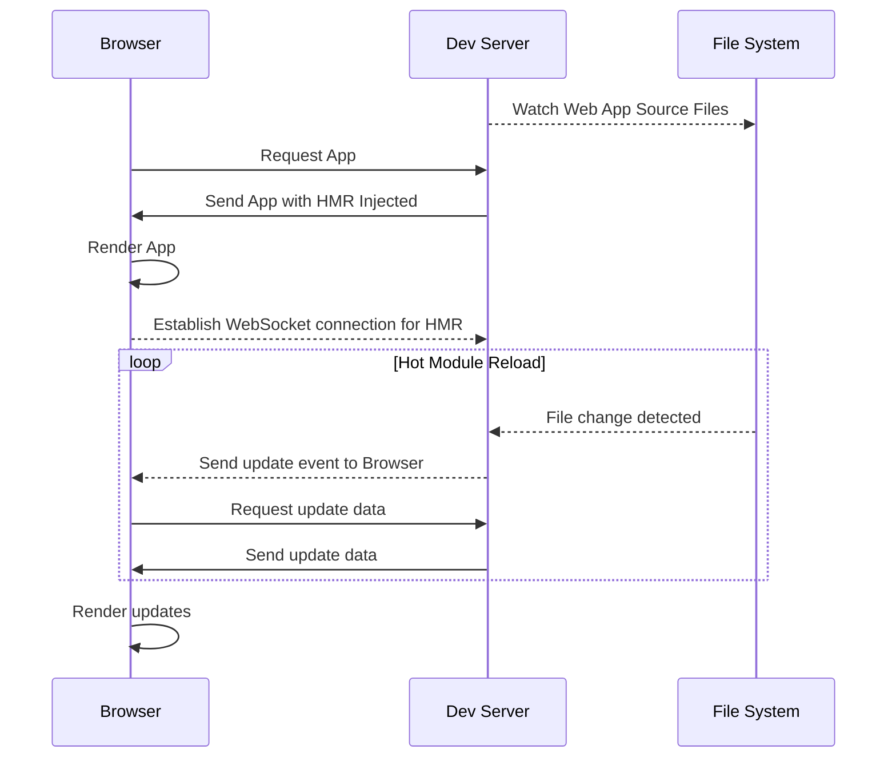

---
# You can also start simply with 'default'
theme: default
# random image from a curated Unsplash collection by Anthony
# like them? see https://unsplash.com/collections/94734566/slidev
# background: https://cover.sli.dev
background: ./images/harper-background.jpg
# some information about your slides (markdown enabled)
title: Trials and Tribulations of Self-Hosting Next.js
info: By Ethan Arrowood and Austin Akers
# apply unocss classes to the current slide
class: text-center
# https://sli.dev/features/drawing
drawings:
  persist: false
# slide transition: https://sli.dev/guide/animations.html#slide-transitions
transition: slide-left
# enable MDC Syntax: https://sli.dev/features/mdc
mdc: true
# open graph
# seoMeta:
#  ogImage: https://cover.sli.dev
---

# Trials and Tribulations of Self-Hosting Next.js

By Ethan Arrowood and Austin Akers

---
layout: two-cols
---

# Who we are


<h2 class="text-center">Ethan Arrowood</h2>

::right::


<h2 class="text-center">Austin Akers</h2>

---
layout: intro
---

# Overview

- 🎨 **Next.js on Harper**
- 🧑‍💻 **Dev Mode Support**
  <!-- WebSocket connection handling. Harper middleware system. -->
- 🧩 **Version Compatibility**
  <!-- Fairly simple section, but highlight how we use dynamic imports. Throw in there the like high-level idea of using 
  defensive code patterns to support backwards compatibility. We can particularly highlight that we had to demonstrate 
  compatibility with old Next.js versions just as a function of business. And then point to the exact line where we made 
  sure to defensively check that the dynamically imported Next server actually had the websocket/devmode hooks that we needed. -->
- 🚧 **Working Directory Platform Limitations** 
  <!-- While relevant to deployments too, this is particularly about how Harper is 
  itself a platform and thus the working directory may not able available to be set to the Next project. 
  Next itself is fine with this, but not all dependencies are. i.e. react-storefront -->
- 🚀 **Deployment Experience**
  <!-- Build mode support, analyzing the build output before pushing to production. integration with CI systems. 
  We can talk about Harper's particular component application deployment process, but relate it back to the expected 
  default experience for deploying Next.js i.e. Vercel and Netlify's default experience. ANd how we emulated that. -->
- 🗄️ **Custom Cache Handling**
  <!-- We actually didn't totally do this meaning we didn't add a custom Next.js cache handler (which is apart of the 
  Next.js server api). But as a platform we did investigate and add support for general request caching. i.e. plain http 
  request caching. harperdb/http-cache module. If time permits we can go into this part, but can also omit since we haven't 
  actually solved it or fully implemented it yet. May just be good to mention as like what we want to do next! -->

---
layout: section
---

# 🎨 Next.js on Harper


<!-- Next.js is a React framework that enables server-side rendering and static site generation for React applications. 
It is designed to make building production-ready applications easier and faster. -->

---
---

# What is Harper?

<div class="grid grid-cols-3 gap-4 mt-32">

<div class="text-center" v-click="1">

Platform as a Service (PaaS)
</div>

<div class="text-center" v-click="2">

Merges multiple layers into a single platform
</div>

<div class="text-center" v-click="3">

Improves performance and scalability of distributed applications
</div>

</div>

---
---

## What is Next.js?

<div class="grid grid-cols-2 gap-4 mt-32">

<div>
- React framework for building server-rendered applications

</div>

<div>

</div>

</div>
---
---

## What does it mean to "support" Next.js?

<div class="grid grid-cols-2 gap-4">
<v-clicks every="1">

- Develop
  - Uphold developer experience expectations
  - Support Next.js development features
  - Integrating with our composable platform
- Build
  - CLI support
  - Local and remote builds
- Deploy
  - Deploy Next.js applications
  - Integrate with Harper's deployment process
- Run
  - Support Next.js runtime features
  - Support Next.js dev mode

</v-clicks>
<div class="justify-self-center flex items-center">

<svg aria-label="Next.js logotype" height="40" role="img" viewBox="0 0 394 79"><path d="M261.919 0.0330722H330.547V12.7H303.323V79.339H289.71V12.7H261.919V0.0330722Z" fill="#ffffff"></path><path d="M149.052 0.0330722V12.7H94.0421V33.0772H138.281V45.7441H94.0421V66.6721H149.052V79.339H80.43V12.7H80.4243V0.0330722H149.052Z" fill="#ffffff"></path><path d="M183.32 0.0661486H165.506L229.312 79.3721H247.178L215.271 39.7464L247.127 0.126654L229.312 0.154184L206.352 28.6697L183.32 0.0661486Z" fill="#ffffff"></path><path d="M201.6 56.7148L192.679 45.6229L165.455 79.4326H183.32L201.6 56.7148Z" fill="#ffffff"></path><path clip-rule="evenodd" d="M80.907 79.339L17.0151 0H0V79.3059H13.6121V16.9516L63.8067 79.339H80.907Z" fill="#ffffff" fill-rule="evenodd"></path><path d="M333.607 78.8546C332.61 78.8546 331.762 78.5093 331.052 77.8186C330.342 77.1279 329.991 76.2917 330 75.3011C329.991 74.3377 330.342 73.5106 331.052 72.8199C331.762 72.1292 332.61 71.7838 333.607 71.7838C334.566 71.7838 335.405 72.1292 336.115 72.8199C336.835 73.5106 337.194 74.3377 337.204 75.3011C337.194 75.9554 337.028 76.5552 336.696 77.0914C336.355 77.6368 335.922 78.064 335.377 78.373C334.842 78.6911 334.252 78.8546 333.607 78.8546Z" fill="#ffffff"></path><path d="M356.84 45.4453H362.872V68.6846C362.863 70.8204 362.401 72.6472 361.498 74.1832C360.585 75.7191 359.321 76.8914 357.698 77.7185C356.084 78.5364 354.193 78.9546 352.044 78.9546C350.079 78.9546 348.318 78.6001 346.75 77.9094C345.182 77.2187 343.937 76.1826 343.024 74.8193C342.101 73.456 341.649 71.7565 341.649 69.7207H347.691C347.7 70.6114 347.903 71.3838 348.29 72.0291C348.677 72.6744 349.212 73.1651 349.895 73.5105C350.586 73.8559 351.38 74.0286 352.274 74.0286C353.243 74.0286 354.073 73.8286 354.746 73.4196C355.419 73.0197 355.936 72.4199 356.296 71.6201C356.646 70.8295 356.831 69.8479 356.84 68.6846V45.4453Z" fill="#ffffff"></path><path d="M387.691 54.5338C387.544 53.1251 386.898 52.0254 385.773 51.2438C384.638 50.4531 383.172 50.0623 381.373 50.0623C380.11 50.0623 379.022 50.2532 378.118 50.6258C377.214 51.0075 376.513 51.5164 376.033 52.1617C375.554 52.807 375.314 53.5432 375.295 54.3703C375.295 55.061 375.461 55.6608 375.784 56.1607C376.107 56.6696 376.54 57.0968 377.103 57.4422C377.656 57.7966 378.274 58.0874 378.948 58.3237C379.63 58.56 380.313 58.76 380.995 58.9236L384.14 59.6961C385.404 59.9869 386.631 60.3778 387.802 60.8776C388.973 61.3684 390.034 61.9955 390.965 62.7498C391.897 63.5042 392.635 64.413 393.179 65.4764C393.723 66.5397 394 67.7848 394 69.2208C394 71.1566 393.502 72.8562 392.496 74.3285C391.491 75.7917 390.043 76.9369 388.143 77.764C386.252 78.582 383.965 79 381.272 79C378.671 79 376.402 78.6002 374.493 77.8004C372.575 77.0097 371.08 75.8463 370.001 74.3194C368.922 72.7926 368.341 70.9294 368.258 68.7391H374.235C374.318 69.8842 374.687 70.8386 375.314 71.6111C375.95 72.3745 376.78 72.938 377.795 73.3197C378.819 73.6923 379.962 73.8832 381.226 73.8832C382.545 73.8832 383.707 73.6832 384.712 73.2924C385.708 72.9016 386.492 72.3564 387.055 71.6475C387.627 70.9476 387.913 70.1206 387.922 69.1754C387.913 68.312 387.654 67.5939 387.156 67.0304C386.649 66.467 385.948 65.9944 385.053 65.6127C384.15 65.231 383.098 64.8856 381.899 64.5857L378.081 63.6223C375.323 62.9225 373.137 61.8592 371.541 60.4323C369.937 59.0054 369.143 57.115 369.143 54.7429C369.143 52.798 369.678 51.0894 370.758 49.6261C371.827 48.1629 373.294 47.0268 375.148 46.2179C377.011 45.4 379.114 45 381.456 45C383.836 45 385.92 45.4 387.719 46.2179C389.517 47.0268 390.929 48.1538 391.952 49.5897C392.976 51.0257 393.511 52.6707 393.539 54.5338H387.691Z" fill="#ffffff"></path></svg>

</div>
</div>


---
layout: section
---

# 🧑‍💻 Dev Mode Support

Dev Mode === Developer Experience

<!-- 
  As discussed in the previous section, Harper is a complete, full-stack application platform.
  As we integrated Next.js we wanted to ensure a quality developer experience. 
  Next.js' dev mode is a critical part of that experience.
-->

---
layout: center
transition: slide-up
---

# What is _Dev Mode_?

---
layout: center
transition: slide-up
---

# Hot Module Reloading

_Instant feedback loop where code changes are reflected in the browser without a full page reload._

---
layout: center
transition: slide-up
---

# Fast Refresh

_Preserves component state throughout refreshes, allowing for a smoother development experience._

---
layout: center
transition: slide-up
---

# Error Overlay

_Displays errors and warnings in the browser, making it easier to debug issues._

---
layout: center
transition: slide-left
---

# Dev-Tools Integration

_Component inspection, performance profiling, and more._

---
layout: center
---

# 🔑 Improved developer experience

<!-- Again, the key to all of this is improving developer experience -->

---
layout: center
---

# 🔎 Hot Module Reloading

<!-- Today, we are going to focus on the Hot Module Reloading part and how we leveraged Harper's server middleware api to forward the necessary WebSocket requests through to the Next.js dev server -->

---
layout: center
---



<!-- Go through the diagram step by step. Starting from the top -->

---
layout: center
---

# 🕸️ The WebSocket API 🔌

- RFC 6455 (first published December 2011)
- Enables real-time communication **without** traditional HTTP polling
- Client sends a HTTP upgrade request to the server
  ```http
  GET /_next/webpack-hmr HTTP/1.1
  Host: localhost:3000
  Upgrade: websocket
  Connection: upgrade
  Sec-WebSocket-Key: dGhlIHNhbXBsZSBub25jZQ==
  Sec-WebSocket-Version: 13
  ```
- Server responds with a `101 Switching Protocols` response
  ```http
  HTTP/1.1 101 Switching Protocols
  Upgrade: websocket
  Connection: upgrade
  Sec-WebSocket-Accept: dGhlIHNhbXBsZSBub25jZQ==
  ```
- Once established, the WebSocket connection allows for full-duplex communication (over the same TCP connection)
  - _full-duplex_ means both client and server can send messages independently
  - 👩‍💼📞👨‍💼 Similar to people talking on the phone, both can speak and listen at the same time

<!-- Note: maybe diagram here? Important to describe that WS works via HTTP Upgrade Request and then the two way connection is established -->

---
layout: center
---

# Remember: Harper is an integrated platform
It has its own HTTP and WebSocket support.

---

# Harper Server API

```javascript
// Custom TCP socket handling (similar to `net.createServer`)
server.socket(connectionListener, options);

// Custom HTTP request handling 
server.http(requestListener, options);

// Custom HTTP upgrade handling
server.upgrade(upgradeListener, options);

// Custom WebSocket connection handling
server.ws(webSocketConnectionListener, options);
```

These methods allow developers to define custom handlers for various networking operations, enabling the creation of custom protocols or the integration of existing ones.

<!-- Similar to other Node middlewares, the Harper server API allows you to define custom handlers for specific networking operations -->

---

# Next.js Server API

Most users only ever interact with Next.js through the `next` CLI (i.e. `next dev`, `next build`, `next start`).

However, Next.js can be used programmatically too!

```javascript {all|11-12}
// As of Next.js v13, v14, and v15:
import next from 'next';

const app = next({ dev: true });

await app.prepare();

const requestHandler = app.getRequestHandler();
// type RequestHandler = (req: IncomingMessage, res: ServerResponse, parsedUrl?: any) => Promise<void>;

const upgradeHandler = app.getUpgradeHandler();
// type UpgradeHandler = (req: IncomingMessage, socket: any, head: any) => Promise<void>;
```

<!-- Unfortunately, its not well documented, but the important parts are... And the part we are going to focus on is this method, getUpgradeHandler -->

---

# 🏗️ All together now...

```javascript {1-5,13|6,10|7-9|12}
// Next.js upgrade handler
const upgradeHandler = app.getUpgradeHandler();

// Harper upgrade middleware
server.upgrade((req, socket, head, next) => {
  if (req.url === '/_next/webpack-hmr') {
    return upgradeHandler(req, socket, head).then(() => {
      return next(req, socket, head);
    })
  }

  return next(req, socket, head);
}, { runFirst: true });
```

<!-- 
1. Get the upgrade handler from Next.js and setup the Harper upgrade handler.
  a. Use the `runFirst` option to ensure that the Next.js upgrade handler runs first.
2. Then inspect the request URL to see if it matches the Webpack HMR endpoint.
3. If it does, call the Next.js upgrade handler to upgrade the connection.
  b. There is some additional nuance to this that I'm glossing over here, but the key is that even after upgrading its important to call `next` so that additional middleware can run.
4. And if it  doesn't match, just call `next` to continue processing the upgrade request.
 -->

---
layout: center
---

# 🎉

Harper can simultaneously handle the Next.js dev server WebSocket requests as well as any other WebSocket requests that the Harper server is handling.

<!-- Maybe a diagram here? -->

<!-- And just like that, we have enabled hot module reloading for Next.js dev mode! Short demo video maybe? -->

---

# 🧩 Version Compatibility

- Dynamic imports
- Defensive code patterns
- Backwards compatibility
- WebSocket and dev mode hooks
- Harper middleware system
- HarperDB HTTP cache module

---
transition: slide-left
---

## Working Directory Platform Limitations

- Harper is a platform
- Working directory may not be available
- Next.js is fine with this

---
transition: slide-right
---

## Deployment Experience
- Build mode support
- Analyzing the build output
- Integration with CI systems
- Harper's component application deployment process
- Vercel and Netlify's default experience
- Emulating that experience

---
transition: slide-up
---

## Custom Cache Handling
- HarperDB HTTP cache module
- General request caching
- Next.js cache handler
- Future work
- What we want to do next

---
transition: slide-up
---

## Conclusion
- Trials and tribulations of self-hosting Next.js

