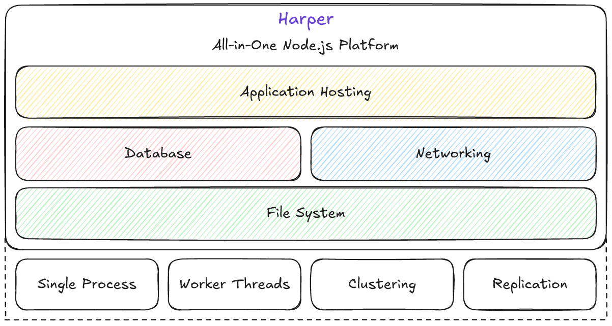
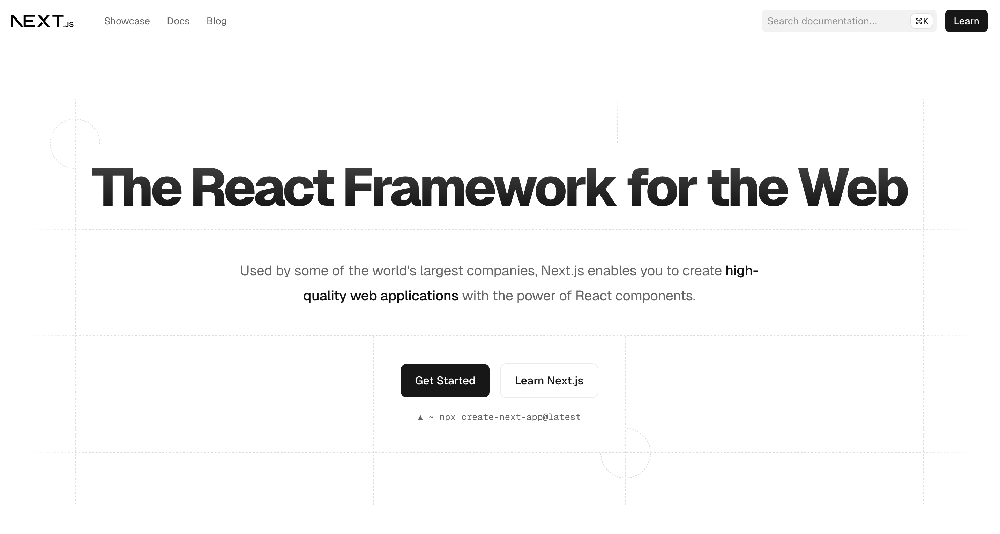
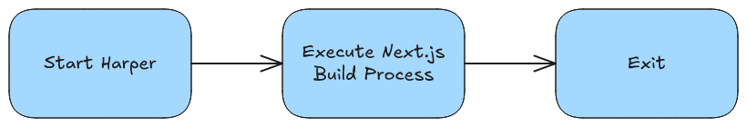
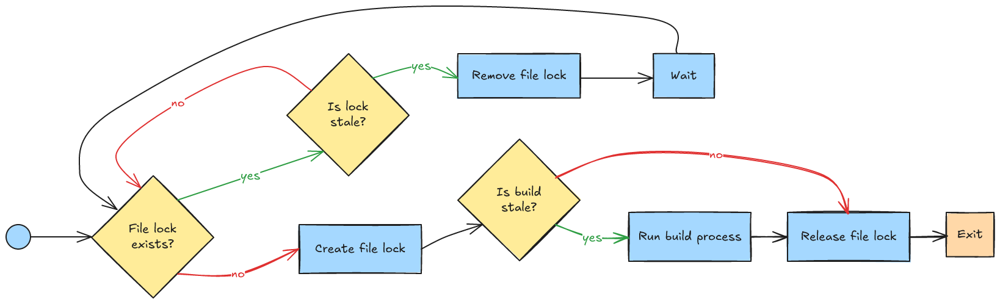
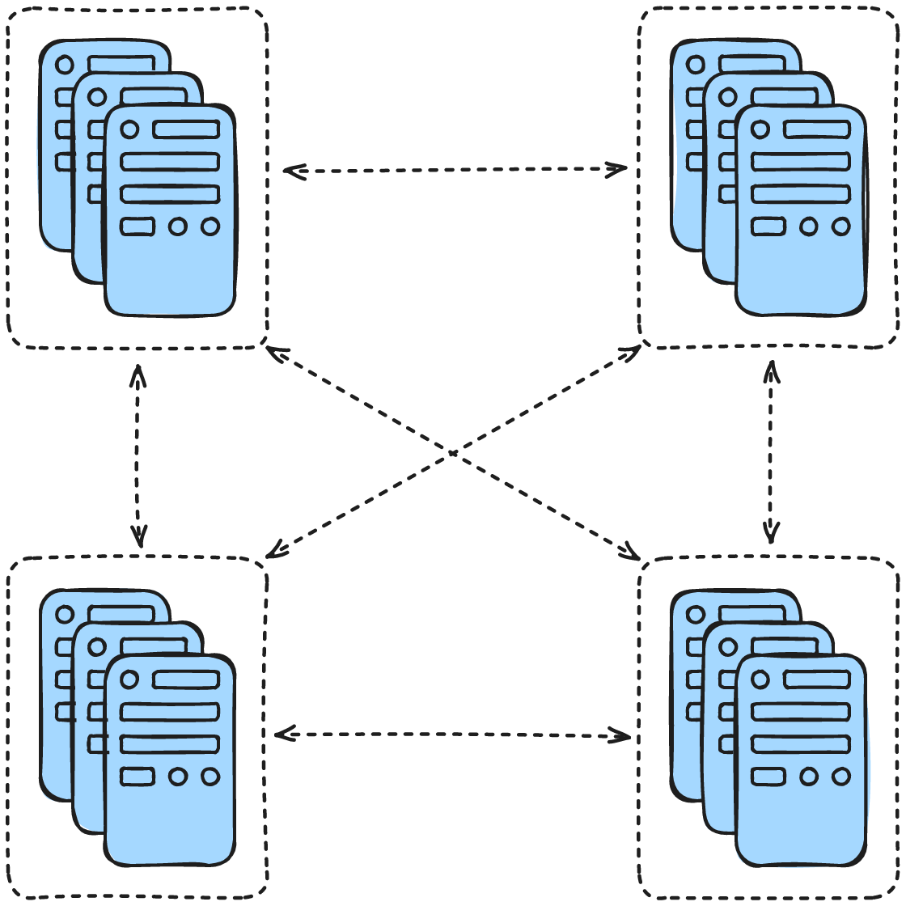

# Trials and Tribulations of Self-Hosting Next.js

By Ethan Arrowood and Austin Akers

---
transition: slide-left
---

<div class="grid grid-cols-2">
  <div class="col-span-2 max-h-min">
    
  </div>

  <div class="text-center">
    
    <h2>Ethan Arrowood</h2>
    <h3>Senior Software Engineer</h3>
    <a href="https://ethanarrowood.com">ethanarrowood.com</a>
    <br />
    <a href="https://linkedin.com/in/ethan-arrowood">linkedin.com/in/ethan-arrowood</a>
  </div>
  <div  class="text-center">
    
    <h2>Austin Akers</h2>
    <h3>Developer Experience Engineer</h3>
    <a href="https://austinakers.com">austinakers.com</a>
    <br />
    <a href="https://www.linkedin.com/in/austin-akers-b1966765/">linkedin.com/in/austin-akers-b1966765</a>
  </div>
</div>
---



<!--
Harper is a serverfull, all-in-one Node.js platform with full file system access, an embedded database, networking middleware system, and application hosting support.
It is built on top of Node.js and operates in a single process, using worker threads for performance, and leverages clustering and replication for production scaling.
The whole platform works together to provide an high performance, easy to use, enterprise-grade development experience.
-->

---
layout: fact
transition: slide-left
---

<h2>Harper<s>DB</s></h2>
<h3><a href="https://harpersystems.dev">harpersystems.dev</a></h3>

<!--
You may have known us as HarperDB previously, recently we rebranded and our now entirely Harper! You may still see "HarperDB" floating around though as we slowly update the name across all our systems
-->

---



<!--
- Next.js is a full-stack react framework for building modern web applications.
- It uses common patterns like server-side rendering, static site generation, and client-side rendering to provide a flexible and powerful development experience.
- But Next.js is more than just what it can create. The entire development experience from prototyping to production is what makes Next.js so powerful.
 -->

---
layout: center
transition: slide-left
---

# Hosting Next.js is surprisingly difficult


<!--
Hosting Next.js is surprisingly difficult
-->

---
layout: center
transition: slide-left
---

# Its much more than just `next start`

<!--
Our goal was not just to host Next.js apps, but provide a holistic Next.js application development experience
-->

---
transition: slide-left
---

# Supporting Next.js

<!-- TODO: improve design of this slide -->


<div class="grid grid-cols-7 gap-4 mt-16 text-center">
  <v-clicks every="2">
  <div class="hidden">
  </div>
  <div>
    <span class="text-4xl">👨🏾‍💻</span>
    <p class="text-2xl font-semibold">Develop</p>
  </div>
  <div>
  <span class="text-4xl my-auto">→</span>
  </div>
  <div>
    <span class="text-4xl">🏗️</span>
    <p class="text-2xl font-semibold">Build</p>
  </div>
  <div>
  <span class="text-4xl">→</span>
  </div>
  <div>
    <span class="text-4xl">🚀</span>
    <p class="text-2xl font-semibold">Deploy</p>
  </div>
  <div>
  <span class="text-4xl">→</span>
  </div>
  <div>
    <span class="text-4xl">⚡️</span>
    <p class="text-2xl font-semibold">Run</p>
  </div>
  </v-clicks>
</div>

<!-- either or - goal: display each step one at a time on the same slide. -->

<!--
So, we came up with a high-level framework to dictate what it means to support Next.js.
- First, "Develop"
- Then, "Build"
- Next, "Deploy"
- Finally, "Run"

Let's dive in!
-->

---
layout: section
transition: slide-up
---

# Develop

<!--
The first aspect of our framework is "Develop".
For us, this meant providing parity with Next's excellent developer experience
-->

---
layout: center
transition: slide-up
---

# `next dev`

<!--
For most developers the first part of Next.js they interact with is the `next dev` command 
-->

---
transition: slide-up
---

# Dev Mode

<!-- TODO: Improve design of this slide -->

<v-clicks>

- <h2 class="font-medium">🔥Hot Module Reloading</h2>
  - <i>Instant feedback loop where code changes are reflected in the browser without a full page reload.</i>
- <h2 class="font-medium mt-4">💨Fast Refresh</h2>
  - <i>Preserves component state throughout refreshes, allowing for a smoother development experience.</i>
- <h2 class="font-medium mt-4">⛔️Error Overlay</h2>
  - <i>Displays errors and warnings in the browser, making it easier to debug issues.</i>
- <h2 class="font-medium mt-4">🛠️Dev-Tools Integration</h2>
  - <i>Displays errors and warnings in the browser, making it easier to debug issues.</i>

</v-clicks>

<!-- 
This encapsulates "Dev Mode" and is the core to Next's excellent developer experience.
-->

---
layout: center
transition: slide-up
---

# 🔎 Hot Module Reloading

<!-- 
Today, we are going to highlight Hot Module Reloading.
This aspect is powered by WebSockets, and was one of the more difficult parts to integrate into Harper.
-->

---
transition: slide-up
layout: image
image: /images/HMR-Sequence-Diagram.png
backgroundSize: contain
---

<!-- _walk through flow diagram step by step_ -->

---
layout: center
transition: slide-up
---

# What is a WebSocket?

<!-- TODO: Keep this brief. Maybe just do the Request/Response HTTP snippets (use the code line highlighter to focus on the `Upgrade & Connection` parts) 
-->

```http {none|1-8|1-3|4-5|10-13|6-8,14-15|all}{lines:true}
# Request
GET /_next/webpack-hmr HTTP/1.1
Host: localhost:9926
Upgrade: websocket
Connection: upgrade
Sec-WebSocket-Version: 13
Sec-WebSocket-Key: *****
Sec-Websocket-Protocol: hmr

# Response
HTTP/1.1 101 Switching Protocols
Upgrade: websocket
Connection: upgrade
Sec-WebSocket-Accept: *****
Sec-WebSocket-Protocol: hmr
```

<!--
(Click through the code snippet to highlight the key parts as these bullets are read)
- But what is a websocket?
- WebSockets enable full duplex communication between client and server, allowing for real-time data exchange, without the need of HTTP request polling.
- The request starts as a regular HTTP GET Request
- That includes the special Upgrade and Connection headers
- The server responds with a 101 Switching Protocols response
- And there may be additional `Sec-WebSocket-*` headers for additional security and protocol information
- Once established, the connection remains open, allowing for continuous data exchange without the overhead of HTTP request polling.
 -->

---
layout: center
transition: slide-up
---

# Harper's networking middleware

```js {1-3|5,11,17|5-9|11-15|17-23}{lines:true }
server.socket((socket) => {
  /* Same as net.createServer() */
}, { port: 1234 });

server.http((req, next) => {
  if (req.url === 'ping') return { status: 200, body: 'pong' };

  return next(req);
});

server.ws((ws, req, chainCompletion, next) => {
  if (req.url === '/ping') ws.send('pong');

  return next(ws, req, chainCompletion);
});

server.upgrade((req, socket, head, next) => {
  if (req.url === '/_next/webpack-hmr') {
    // Handle the WebSocket upgrade for HMR
  }

  return next(req, socket, head);
}, { runFirst: true });


```

<!--
"Remember Harper's architecture diagram? We have a highly extensible networking middleware system"
"This system allows us to hook into the request/response lifecycle and do custom HTTP upgrade and WebSocket connection handling"
- We enable creating a fully custom TCP socket server with `server.socket()` (which is similar to Node.js' `net.createServer()`)
- Then we have 3 middleware methods, `http`, `ws`, and `upgrade`.
- The `http` method is used to handle regular HTTP requests, we have an embedded HTTP server that can be hooked into, but you can also specify the `port` property to create a new HTTP server.
- The `ws` method is used to handle WebSocket connections, and it allows us to handle WebSocket messages and events. Similarly, we have a default, but a custom port can be specified too.
- Finally, the `upgrade` method is used to handle WebSocket upgrades, which is what we need for Next.js' Hot Module Reloading.
  - You'll noticed on this example we are using the `runFirst` option, which allows us to run this middleware before any other WebSocket middleware (for the default WS connection).
- This networking API allows developers to create highly customized networking solutions, and it is the foundation for our Next.js support.
-->

---
layout: center
transition: slide-up
---

# Next.js Server API

```javascript {all|1-6|8|10-12}{lines:true}
import next from 'next';

const app = next({
  dir: 'path/to/app',
  dev: true
});

await app.prepare();

const requestHandler = app.getRequestHandler();

const upgradeHandler = app.getUpgradeHandler();
```


<!--
- And like we said at the beginning, supporting Next.js is much more than just `next start`.
- It isn't very well known, but Next.js has a server API that allows for programmatic control over the server.
- It isn't too complex, basically after importing the `next` package, you can create a Next.js server instance by calling the imported function
  - It has a number of options, but for right now we are only interested in the `dir` and `dev` options.
- Then you can call `await app.prepare()` to prepare the application
- Finally, you can get the request handler and upgrade handler by calling `app.getRequestHandler()` and `app.getUpgradeHandler()`, respectively.
-->

---
layout: center
transition: slide-left
---

# Putting it all together

```javascript {1-5,13|6,10|7-9|12}
// Next.js upgrade handler
const upgradeHandler = app.getUpgradeHandler();

// Harper upgrade middleware
server.upgrade((req, socket, head, next) => {
  if (req.url === '/_next/webpack-hmr') {
    return upgradeHandler(req, socket, head).then(() => {
      return next(req, socket, head);
    })
  }

  return next(req, socket, head);
}, { runFirst: true });
```
<!--
1. Get the upgrade handler from Next.js and setup the Harper upgrade handler.
  a. Use the `runFirst` option to ensure that the Next.js upgrade handler runs first.
2. Then inspect the request URL to see if it matches the Webpack HMR endpoint.
3. If it does, call the Next.js upgrade handler to upgrade the connection.
  b. There is some additional nuance to this that I'm glossing over here, but the key is that even after upgrading its important to call `next` so that additional middleware can run.
4. And if it  doesn't match, just call `next` to continue processing the upgrade request.
-->

--- 
layout: center
transition: slide-left
---

<!-- TODO: Insert a small recording / gif of our CLI kicking off and starting up both Harper and the Next.js dev server in a terminal 
note: might have to simplify the Harper output a bit - it seems to be spitting out some other info that isn't relevant to this example.
-->

# Lastly, `harperdb-nextjs dev`


<!-- 
Since we run Next.js within the Harper process, we created our own CLI experience.

It is quite simple, but importantly it bootstraps Harper and ensures the right environment is set up for Next.js dev server.
-->

---
transition: slide-up
layout: section
---

# Build

<!-- 
Next up in our framework is "Build"
 -->

---
layout: center
transition: slide-up
---

# `harperdb-nextjs build`



<!--
The next step in our framework is to support _building_ Next.js apps

This was where our CLI experience really started to take shape

Just like the `next dev` command, we created a `harperdb-nextjs build` command that would run the Next.js build operation within the Harper process, and then cleanly exit
-->

---
transition: slide-up
---

# Thread-safe build process



<!-- 
Given that Harper is a single-process, multi-threaded platform, we needed to ensure that the build process was isolated.
(Why build the same app multiple times on the same machine, right?)

Threads in Harper generally all do the same thing unless we specify otherwise.

We are actively improving this experience, but at the beginning we created a custom file-based thread locking mechanism to ensure that only one thread would run the build process.

This solution worked pretty well, and this flow diagram documents how it works
-->

---
layout: center
transition: slide-left
---

# Build artifacts add up quickly!

<!-- TODO: style this slide better - particularly the bullet points at the bottom. Maybe have them appear on click? -->


- Local Builds (`prebuilt: true`)
- Build on instance (`harperdb deploy`) 

<!-- 
Unlike serverless platforms that treat each build and deployment as an independent unit, Harper instances are long running, serverfull processes.

We couldn't really provide the same ephemeral build experience without completely filling up our users's Harper instances with build artifacts.

So instead, at least for now, we kept things simple. Builds can happen either locally or remotely, but they will always override what is currently running.

And this leads us to the next step in our framework: ...
 -->

---
layout: section
transition: slide-up
---

# Deploy

---
layout: center
transition: slide-up
---

# Clustering & Replication



<!--
Production Harper systems are often clustered and replicated across regions.

This is a major performance and reliability feature of the platform.
-->

---
layout: center
transition: slide-up
---

# Rolling Deployments

<!--
So, since we don't really fit into the regular serverless model of ephemeral deployments, we had to come up with a way to deploy applications without disrupting production.

You wouldn't want your entire database to be reset every time you deployed your web app, right?

Integrating with our clustering and replication process, we utilize a rolling deployment system. And the best part is this isn't even unique to just Next.js.

The entire Harper platform uses this technique to distribute operations across the network.
-->

---
layout: image
image: /images/Rolling-Deploys-1.png
backgroundSize: contain
transition: fade
---

<!-- Given a new application deployment, it can be deployed to any one of the available clusters -->

---
layout: image
image: /images/Rolling-Deploys-2.png
backgroundSize: contain
transition: fade
---

<!-- Whichever cluster is first will execute the build and deploy sequence, and then replicate it to another node -->

---
layout: image
image: /images/Rolling-Deploys-3.png
backgroundSize: contain
transition: fade
---

<!-- As the deploy operation is replicated across the instances, production disruption is greatly minimized -->

---
layout: image
image: /images/Rolling-Deploys-4.png
backgroundSize: contain
transition: fade
---

<!-- Once all the node receive the update, the operation completes -->

---
layout: image
image: /images/Rolling-Deploys-5.png
backgroundSize: contain
transition: slide-up
---

<!-- And the application is fully deployed! -->

---
layout: center
transition: slide-left
---

# `harperdb deploy`


<!-- 
And like we said, this isn't just for Next.js applications.

Harper already had this replication and clustering system in place for other operations, so we were able to leverage it to create a positive Next.js application deployment experience.
-->

---
layout: section
transition: slide-up
---

# Run

<!-- Finally, the app is build and deployed, now its time to run it! -->

---
layout: center
transition: slide-up
---

# _No_, we still aren't using `next start`


---
layout: center
transition: slide-up
---

Next.js Server API and Harper HTTP Middleware

```javascript {1-6|8-11|13-21|all}{lines:true}
const componentPath = 'path/to/app';
const routesManifestPath = path.join(
  componentPath, '.next', 'routes-manifest.json');
const app = next({ dir: componentPath });

await app.prepare();

const requestHandler = app.getRequestHandler();

const routes = JSON.parse(
  await fs.promises.readFile(routesManifestPath, 'utf8'));

server.http((request, next) => {
  return matchRoutes(routes, request.url)
    ? requestHandler(
        request._nodeRequest,
        request._nodeResponse,
        url.parse(request._nodeRequest.url, true)
      )
    : next(request);
});
```

<!-- 
So just like we used the Next.js Server API to handle WebSocket upgrades, we can also use it to run the application.
- Start by setting up the `app` instance
- Get the `requestHandler` and the routes information
- And then hook into Harper's HTTP middleware system
This example is overly simplified, but the jist is that we delegate the request handling to Next.js and it just works!
 -->

---
layout: center
transition: slide-up
---

# Version Compatibility

```javascript {1|3-4|6-8|all}{lines:true}
import { createRequire } from 'node:module';

const appPath = 'path/to/app';
const appRequire = createRequire(applicationPath);

const nextImport = await import(appRequire.resolve('next'));

const next = nextImport.default || nextImport;

const app = next({ dir: appPath });
// ...
```

<!--
Next.js has many versions, and honestly it takes a lot of time for users to migrate and upgrade.
It was imperative we support multiple versions of Next.js.
And it turns out, Next prefers that the same version of it is used to run the app that is used to build it.
So we leverage Node.js' dynamic import system to load the Next.js version that is installed in the application.
- It isn't too complicated, using the `createRequire` function we can create a require function that is scoped to the application directory.
- This lets us resolve the Next.js package sort of like how a regular import would work
- Then we use a dynamic import to load the Next.js package
- Finally, we can create the Next.js app instance and do all the other hooks
This code has enabled us to dynamically support many major Next.js versions!
-->

---
layout: center
transition: slide-up
---

# Multi-Zone support
(a.k.a. micro-frontends)

<!--
We probably sound like a broken record at this point, but Harper isn't your isolated, serverless environment host.
Thus, we have the ability to run multiple applications in the same process, and this naturally lead us to exploring support for Next.js multi-zone applications also known as micro-frontends.

This pattern has mixed feelings, but it is very popular in Enterprise companies.
 -->

---
layout: image
image: /images/Multi-Zone-Architecture.png
backgroundSize: contain
transition: slide-up
---

<!-- 
Multi-Zone is basically multiple separate Next.js applications. Traditionally deployed across multiple hosts.
As requests come in, they will be routed to the appropriate application through Next.js' assetPrefix and redirects configuration options.
 -->

---
layout: image
image: /images/Multi-Zone-Flow-Chart.png
backgroundSize: contain
transition: slide-up
---

<!-- 
But since Harper can run all three apps simultaneously on the same server, we have experimented with custom routing.
Similar to the HTTP handler we had earlier, where we import the routes manifest and use within the http middleware,
one idea we had was if we know the routes for each application, we could in theory just structure the middleware to route requests based on successful matches.
And if the first middleware doesn't match, it passes it along until the end.

This is very similar to how Next.js generally handles multi-zone routing, but ideally we can decrease the amount of "hard-navigation" that has to happen.
-->

---
layout: center
transition: slide-up
---

# ... One issue


<!-- But unfortunately, as cool as this custom routing idea is, we actually ran into a pretty difficult limitation -->

---
layout: center
transition: slide-up
---

# The Working Directory Problem

<!-- 
Generally, its assumed that the working directory whenever you build or run a Next.js app is the app source directory itself.

This is most common during development, and is also how many hosts work.
 -->

---
layout: center
transition: slide-up
---

# Single Process... Single Working Directory

<!--
One of the biggest limitations of being a single process platform is that we have a single working directory.

And in the multi-zone case, where there are multiple distinct Next.js applications, this **can** be a problem.
-->

---
layout: center
transition: slide-left
---

# Next.js is fine with this...

## Just, _some_ React dependencies aren't unfortunately


<!-- 
Now luckily Next.js itself is not affected, but some application dependencies do.

We haven't really found a workaround for this, but its generally avoidable with good application design and implementation
 -->

---
layout: section
transition: slide-left
---

# What's Next?

---
layout: center
transition: slide-up
---

# Routing Improvements
HTTP Middleware, Multi-Zone, and more

---
layout: center
transition: slide-up
---

# Custom Cache Handler
Not just HTTP request caching, but also Next.js' internal cache

---
layout: center
transition: slide-up
---

# Abstractions for other frameworks
How can we supercharge Astro, Svelte, Vue, and more?

---
layout: section
---

# Dev → Build → Deploy → Run

## You can self-host Next.js, but it’s more than just `next start`

---
transition: slide-left
---

<div class="grid grid-cols-2">
  <div class="col-span-2 max-h-min">
    
  </div>

  <div class="text-center">
    
    <h2>Ethan Arrowood</h2>
    <h3>Senior Software Engineer</h3>
    <a href="https://ethanarrowood.com">ethanarrowood.com</a>
    <br />
    <a href="https://linkedin.com/in/ethan-arrowood">linkedin.com/in/ethan-arrowood</a>
  </div>
  <div  class="text-center">
    
    <h2>Austin Akers</h2>
    <h3>Developer Experience Engineer</h3>
    <a href="https://austinakers.com">austinakers.com</a>
    <br />
    <a href="https://www.linkedin.com/in/austin-akers-b1966765/">linkedin.com/in/austin-akers-b1966765</a>
  </div>
</div>

<!-- Thank you! -->
