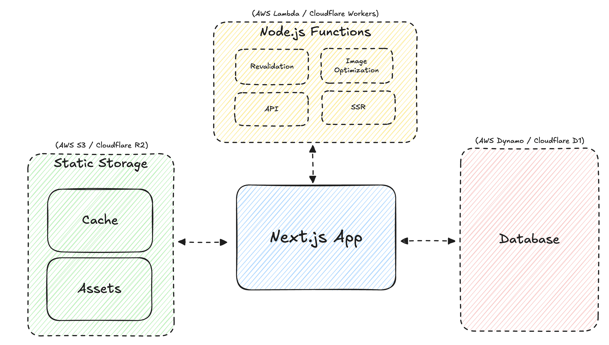
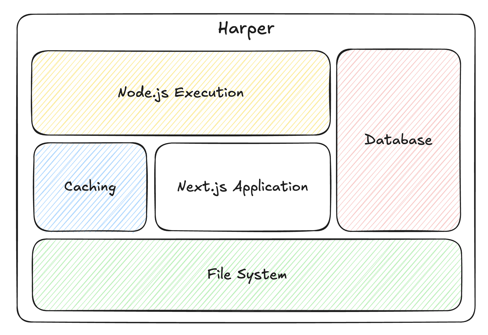
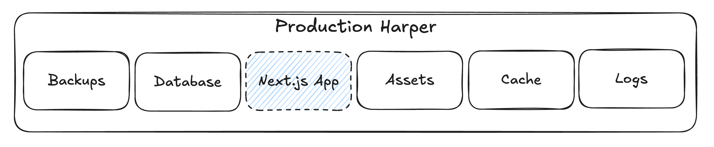
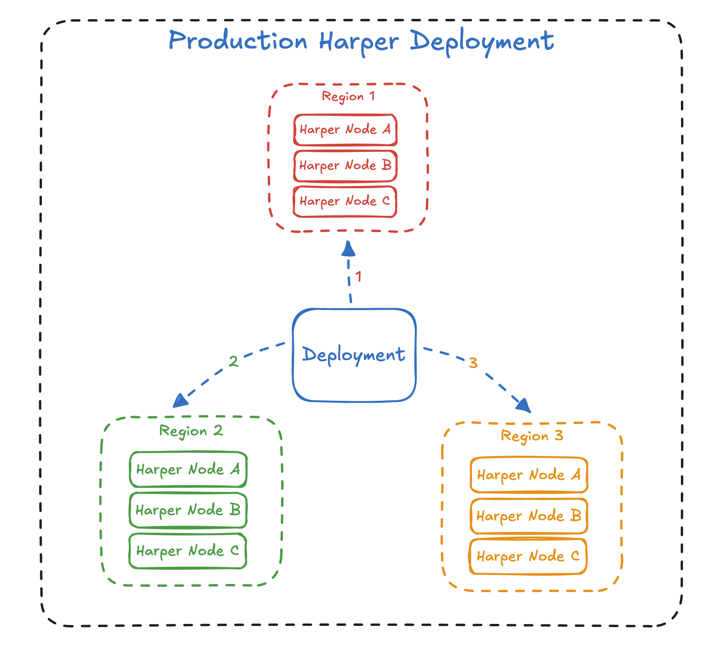
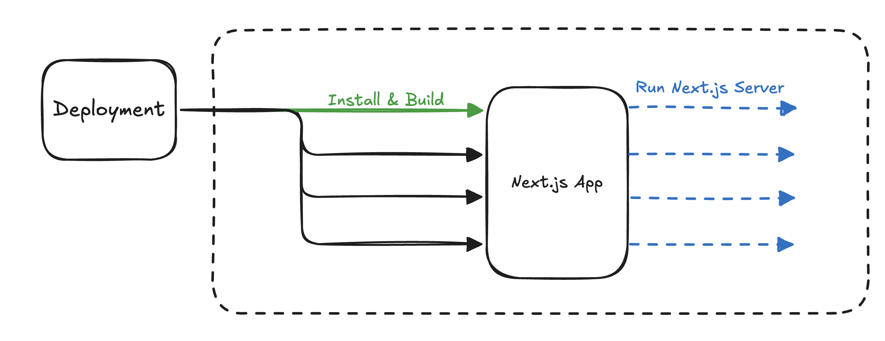

---
# You can also start simply with 'default'
theme: default
# random image from a curated Unsplash collection by Anthony
# like them? see https://unsplash.com/collections/94734566/slidev
# background: https://cover.sli.dev
background: ./images/harper-background.jpg
# some information about your slides (markdown enabled)
title: Trials and Tribulations of Self-Hosting Next.js
info: By Ethan Arrowood and Austin Akers
# apply unocss classes to the current slide
class: text-center
# https://sli.dev/features/drawing
drawings:
  persist: false
# slide transition: https://sli.dev/guide/animations.html#slide-transitions
transition: slide-left
# enable MDC Syntax: https://sli.dev/features/mdc
mdc: true
# open graph
# seoMeta:
#  ogImage: https://cover.sli.dev
lineNumbers: true
---

# Trials and Tribulations of Self-Hosting Next.js

By Ethan Arrowood and Austin Akers

---
layout: two-cols-header
---

# Who we are

::left::


## Ethan Arrowood

::right::


## Austin Akers

---
layout: intro
---

# Overview

- 🎨 **Next.js on Harper**
- 🧑‍💻 **Dev Mode Support**
  <!-- WebSocket connection handling. Harper middleware system. -->
- 🧩 **Version Compatibility**
  <!-- Fairly simple section, but highlight how we use dynamic imports. Throw in there the like high-level idea of using 
  defensive code patterns to support backwards compatibility. We can particularly highlight that we had to demonstrate 
  compatibility with old Next.js versions just as a function of business. And then point to the exact line where we made 
  sure to defensively check that the dynamically imported Next server actually had the websocket/devmode hooks that we needed. -->
- 🏘️ **Multi-Zone Next.js**
  <!-- While relevant to deployments too, this is particularly about how Harper is 
  itself a platform and thus the working directory may not able available to be set to the Next project. 
  Next itself is fine with this, but not all dependencies are. i.e. react-storefront -->
  <!-- I originally called this section Working Directory, but rather than highlighting what could be interpreted as a limitation
  of harper, I'm switching it to multi-zone so that we are highlighting yet another feature! -->
- 🚀 **Deployment Experience**
  <!-- Build mode support, analyzing the build output before pushing to production. integration with CI systems. 
  We can talk about Harper's particular component application deployment process, but relate it back to the expected 
  default experience for deploying Next.js i.e. Vercel and Netlify's default experience. ANd how we emulated that. -->
- 🗄️ **Custom Cache Handling**
  <!-- We actually didn't totally do this meaning we didn't add a custom Next.js cache handler (which is apart of the 
  Next.js server api). But as a platform we did investigate and add support for general request caching. i.e. plain http 
  request caching. harperdb/http-cache module. If time permits we can go into this part, but can also omit since we haven't 
  actually solved it or fully implemented it yet. May just be good to mention as like what we want to do next! -->

---
layout: section
---

# 🎨 Next.js on Harper

Next.js is a React framework that enables server-side rendering and static site generation for React applications. It is designed to make building production-ready applications easier and faster.

---
layout: section
---

# 🧑‍💻 Dev Mode Support

Dev Mode === Developer Experience

<!-- 
  As discussed in the previous section, Harper is a complete, full-stack application platform.
  As we integrated Next.js we wanted to ensure a quality developer experience. 
  Next.js' dev mode is a critical part of that experience.
-->

---
layout: center
transition: slide-up
---

# What is _Dev Mode_?

---
layout: center
transition: slide-up
---

# Hot Module Reloading

_Instant feedback loop where code changes are reflected in the browser without a full page reload._

---
layout: center
transition: slide-up
---

# Fast Refresh

_Preserves component state throughout refreshes, allowing for a smoother development experience._

---
layout: center
transition: slide-up
---

# Error Overlay

_Displays errors and warnings in the browser, making it easier to debug issues._

---
layout: center
transition: slide-left
---

# Dev-Tools Integration

_Component inspection, performance profiling, and more._

---
layout: center
---

# 🔑 Improved developer experience

<!-- Again, the key to all of this is improving developer experience -->

---
layout: center
---

# 🔎 Hot Module Reloading

<!-- Today, we are going to focus on the Hot Module Reloading part and how we leveraged Harper's server middleware api to forward the necessary WebSocket requests through to the Next.js dev server -->

---
layout: center
---


<!-- Go through the diagram step by step. Starting from the top -->

---
layout: center
---

# 🕸️ The WebSocket API 🔌

- RFC 6455 (first published December 2011)
- Enables real-time communication **without** traditional HTTP polling
- Client sends a HTTP upgrade request to the server
  ```http
  GET /_next/webpack-hmr HTTP/1.1
  Host: localhost:3000
  Upgrade: websocket
  Connection: upgrade
  Sec-WebSocket-Key: dGhlIHNhbXBsZSBub25jZQ==
  Sec-WebSocket-Version: 13
  ```
- Server responds with a `101 Switching Protocols` response
  ```http
  HTTP/1.1 101 Switching Protocols
  Upgrade: websocket
  Connection: upgrade
  Sec-WebSocket-Accept: dGhlIHNhbXBsZSBub25jZQ==
  ```
- Once established, the WebSocket connection allows for full-duplex communication (over the same TCP connection)
  - _full-duplex_ means both client and server can send messages independently
  - 👩‍💼📞👨‍💼 Similar to people talking on the phone, both can speak and listen at the same time

<!-- Note: maybe diagram here? Important to describe that WS works via HTTP Upgrade Request and then the two way connection is established -->

---
layout: center
---

# Remember: Harper is an integrated platform
It has its own HTTP and WebSocket support.

---

# Harper Server API

```javascript
// Custom TCP socket handling (similar to `net.createServer`)
server.socket(connectionListener, options);

// Custom HTTP request handling 
server.http(requestListener, options);

// Custom HTTP upgrade handling
server.upgrade(upgradeListener, options);

// Custom WebSocket connection handling
server.ws(webSocketConnectionListener, options);
```

These methods allow developers to define custom handlers for various networking operations, enabling the creation of custom protocols or the integration of existing ones.

<!-- Similar to other Node middlewares, the Harper server API allows you to define custom handlers for specific networking operations -->

---

# Next.js Server API

Most users only ever interact with Next.js through the `next` CLI (i.e. `next dev`, `next build`, `next start`).

However, Next.js can be used programmatically too!

```javascript {all|11-12}
// As of Next.js v13, v14, and v15:
import next from 'next';

const app = next({ dev: true });

await app.prepare();

const requestHandler = app.getRequestHandler();
// type RequestHandler = (req: IncomingMessage, res: ServerResponse, parsedUrl?: any) => Promise<void>;

const upgradeHandler = app.getUpgradeHandler();
// type UpgradeHandler = (req: IncomingMessage, socket: any, head: any) => Promise<void>;
```

<!-- Unfortunately, its not well documented, but the important parts are... And the part we are going to focus on is this method, getUpgradeHandler -->

---

# 🏗️ All together now...

```javascript {1-5,13|6,10|7-9|12}
// Next.js upgrade handler
const upgradeHandler = app.getUpgradeHandler();

// Harper upgrade middleware
server.upgrade((req, socket, head, next) => {
  if (req.url === '/_next/webpack-hmr') {
    return upgradeHandler(req, socket, head).then(() => {
      return next(req, socket, head);
    })
  }

  return next(req, socket, head);
}, { runFirst: true });
```

<!-- 
1. Get the upgrade handler from Next.js and setup the Harper upgrade handler.
  a. Use the `runFirst` option to ensure that the Next.js upgrade handler runs first.
2. Then inspect the request URL to see if it matches the Webpack HMR endpoint.
3. If it does, call the Next.js upgrade handler to upgrade the connection.
  b. There is some additional nuance to this that I'm glossing over here, but the key is that even after upgrading its important to call `next` so that additional middleware can run.
4. And if it  doesn't match, just call `next` to continue processing the upgrade request.
 -->

---
layout: center
---

# 🎉

Harper can simultaneously handle the Next.js dev server WebSocket requests as well as any other WebSocket requests that the Harper server is handling.

<!-- Maybe a diagram here? -->

<!-- And just like that, we have enabled hot module reloading for Next.js dev mode! Short demo video maybe? -->

---

# 🧩 Version Compatibility

- Dynamic imports
- Defensive code patterns
- Backwards compatibility
- WebSocket and dev mode hooks
- Harper middleware system
- HarperDB HTTP cache module

---
layout: center
---

# 🏘️ Multi-Zone Next.js

---
layout: image-right
image: /images/multi-zone-stacked.png
backgroundSize: contain
---

# What is Multi-Zone Next.js?

An architecture where a singular application is implemented as multiple, distinct Next.js applications.
- Each part (or zone) is a separate Next.js application
- Each zone can be developed, built, and deployed independently
- Combined, they create a cohesive user experience
- Traditionally, required multiple hosts and performance-sensitive hard navigation
- However, Harper can handle multiple Next.js applications simultaneously!

---
layout: center
---

# How?

Well first... a little background on Harper's architecture.

---
layout: image-right
image: /images/harper-worker-threads.png
backgroundSize: contain
---

# Harper uses Worker Threads

- Harper, like the Node.js runtime its built on, is **single-process**
- For performance, Harper uses **worker threads** to parallelize operations
- Each thread runs the same collection of server middleware
- Requests are distributed across threads
- All threads **share the same working directory**

---
layout: image
image: /images/harper-applications.png
backgroundSize: contain
---

<!-- # Harper supports Multi-Zone Next.js

- With Next.js' ability to execute any app as long as you provide the complete application directory
- And Harper's performant, and highly configurable server middleware system
- Harper can easily run multiple, distinct Next.js applications simultaneously
- Multi Zone Next.js requires special configuration (`assetPrefix` and `rewrites` options in `next.config.js`) -->

---
layout: center
---

# _What's the catch?_

---
layout: center
---

# Next.js and the process **working directory**.

---
layout: center
---

# What is a _working directory_?

A working directory is the file system location where a **process** executes from.


Node.js is a single-process runtime; thus, it has a singular working directory (`process.cwd()`).

<!-- Many operations will use this by default. For example, path resolution in many Node.js apis will transform the period character to the current working directory. -->

---
layout: image-right
image: /images/next-process-execution.png
backgroundSize: contain
---

# Next.js Execution

Happens twice...

1. **Built Time** (`next build`): application source code is compiled and optimized into the `.next` directory
2. **Run Time** (`next start`): the Next.js server process serves the application from the `.next` directory

The **working directory** for these two steps can be *the same or different*. 

<!-- A Next.js app can even be built on one machine, and deployed and run on another! (this is generally referred to as prebuilt mode). There is some nuance to this (like if you are using native dependencies). But in essence, as long as the entirety of the Next app is kept together, it should be executable. -->

---
layout: center
---

# Next.js doesn't care about the working directory, as long as *all necessary files* are present in the application directory.

---

# Next.js Server API

```javascript
import next from 'next';

const app = next({
  dir: '/path/to/nextjs-app'
});
```

The `dir` option must be set to the **directory containing the Next.js application**. This is the directory that contains:
- The Next.js build output (`.next` directory)
- Configuration files (`package.json`, `next.config.js`, `.env`, etc.)
- Any external dependencies (`node_modules`)

The *working directory* of the process running the Next.js server *should* not matter as long as the `dir` option is set correctly.

<!-- Furthermore... the Next.js server API demonstrates this even more clearly. -->

---
layout: center
---

# Here is the problem...

---
layout: center
---

# Some dependencies **rely** on `process.cwd()` to resolve paths. 🤦‍♂️

---
layout: image
image: /images/harper-applications.png
backgroundSize: contain
---

<!-- And so if we look back at this diagram of Harper's middleware system. Remember that we are simply using the Next.js server API, 
but if either (or worse, both) of these apps require the working directory to run... then we have a fundamental issue! -->

---
layout: center
---

# Unfortunately, we haven't quite solved this yet 👷‍♂️🧰
But the most performant Multi-Zone Next.js apps on Harper don't rely on the working directory!

<!-- If an app requires the working directory we just have to revert back to the traditional hosting architecture. -->

---
layout: center
---

# 🚀 Deployment

---

# Most Next.js apps are deployed as many pieces



---

# But Harper is all-in-one!



---

# The Next.js server-side code runs in the same process as the database.

```js {1|3-8|10-19}
import { tables } from 'harper';

// `/dog/[id]`
export function Page({ params }) {
  const dog = await table.Dog.get(params.id);

  return <h1>{dog.name}</h1>;
}

export async function generateStaticParams() {
  const dogs = [];

  for await (const dog of tables.Dog.search()) {
    dogs.push({ id: dog.id });
  }

  return dogs;
}
```

---

# Harper deployments are not ephemeral
You wouldn't want to lose your database data on every deploy!



---

# Every Deployment requires

<!-- use the v-step animation feature here? -->

1. 📦 Install
2. 🏗️ Build
3. 🚀 Run

---

# How do we achieve this on a live system?

--- 

# Rolling updates ensure consistent uptime



---

# Thread-isolated install and build operations



---

# Refresh the Next.js Server!


---
transition: slide-up
---

## Custom Cache Handling
- HarperDB HTTP cache module
- General request caching
- Next.js cache handler
- Future work
- What we want to do next

---
transition: slide-up
---

## Conclusion
- Trials and tribulations of self-hosting Next.js

